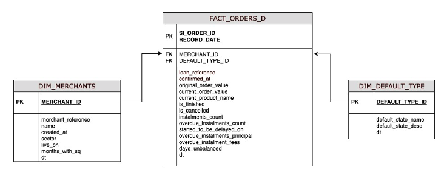

# SeQura Data Engineering

## Data Modeling Question

With the objective of controlling the optimum Risk levels of the company, a dashboard is requested, in our case
Tableau, to be able to analyze the state of each defaulted loan by cohorts. This means visualizing how loans evolve
by sector, merchant, default type and current_product_name. (Example: Matrix of month to be analyzed x loan
confirmation month)

Given the following table images and tips on the size of the fact table, how would you model and optimize the table/s
needed in the DWH to be used by Tableau?

Tips:
- FACT table ‘ FACT_ORDERS_D ’ with daily photos of the state of each credit from 2017, it contains more than
1,4B of rows
- ‘ DIM_Merchants'
- ‘DIM_Type of Default’ with the classification of the arrears credits

:thumbsup: [Proposed solution for the data modeling question](SOLUTIONS_DATA_MODELING.md).
