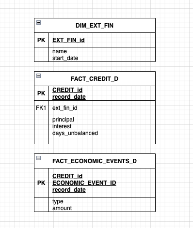

# SeQura Data Engineering

## SQL Question 1

Two fact tables are provided: FACT_CREDIT_D, which contains daily snapshots of the state of all the granted loans since the
start of the company (every day all the credits info is loaded, approx size 900M records) and the economic events related to each
of the loans, FACT_ECONOMIC_EVENTS_D.

A dimension is also provided, DIM_EXT_FIN, that contains the information of the external financiers that buy and sell loans.

You are asked to extract all the events of type “Chargeback” that the external Financier “Fund2” has produced during 2022.



### Data Sample

```
DIM_EXT_FIN
Ext_fin_id;name;start_date
1;”Inv1”;2020-04-18
2;”Fund2”;2021-10-11
```

```
FACT_CREDIT_D
Credit_id;record_date;ext_fin_id;principal;interest;days_unbalanced
15;2022-01-05;1;100;3;0
15;2022-01-06;1;100;3;0
16;2022-01-06;1;80;2;1
15;2022-01-07;1;100;3;0
16;2022-01-07;1;80;2;1
17;2022-01-07;2;300;3
18;2022-01-07;2;50;3;0
15;2022-01-08;1;100;3;0
16;2022-01-08;1;80;2;1
17;2022-01-08;2;300;3
18;2022-01-08;2;50;3;0
19;2022-01-08;2;65;3;0
```

```
FACT_ECONOMIC_EVENTS_D
Credit_id;economic_event_id;record_date;type;amount
15;1;2022-01-05;”installment”;5
15;2;2022-01-05;”chargeback”;10
17;3;2022-01-07;”chargeback”;10
18;4;2022-01-08;”payment”;50
18;5;2022-01-10;”chargeback”;50
19;6;2022-01-10;”payment”;30
```

:thumbsup: [Proposed solution for the sql question 1](SOLUTIONS_SQL_1.md).
