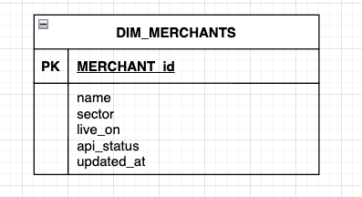

# SeQura Data Engineering

## SQL Question 2 - Merchants Growth

Estimate the growth of the merchant contracts signed each year using the live_on date and the api status field.

The rate of growth is calculated by taking ((number of merchants with api_status allowed and live_on in the current year - number
of merchants with api_status allowed and live_on in the previous year) / number of merchants with api_status allowed and
live_on in the previous year) * 100.

Output the year, number of merchants in the current year, number of merchants in the previous year, and the rate of growth.

Round the rate of growth to the nearest percent and order the result in the ascending order based on the year.

Assume that the dataset consists only of unique merchants



### Data Sample

```
DIM_MERCHANTS
Merchant_id;Name;Sector;Live_on;Api_status;Updated_at
1;’trajesamedida’;’retail’;2020-07-25;’allowed’;2020-07-25
25;’decoracionMark’;’home’;2018-06-08;’allowed’;2021-02-17
4;’superdiario’;’food’;2018-11-05;’allowed’;2021-02-17
10;’ropainterior’;’retail’;;’allowed’;2021-02-17
11;’proteinasaltorendimiento’;’health’;2018-03-15;’denied’;2021-02-17
12;’gimnasioMoreno’;’health’;2019-08-17;’allowed’;2021-02-17
6;’cuerpoyvida’;’health’;2021-01-14;’supervised’;2021-02-20
2;’dietasana’;’health’;2021-01-15;’allowed’;2021-02-20
3;’ropadesalon’;’retail’;2019-01-02;’supervised’;2021-02-20
13;’menajecocina’;’home’;;’allowed’;2021-02-06
```

:thumbsup: [Proposed solution for the sql question 2](SOLUTIONS_SQL_2.md).
