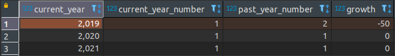

# SeQura Data Engineering

## Solution  for the SQL Question 2

```
WITH stats AS (

  SELECT
    DATE_PART('y', live_on) AS s_year,
    count(m.merchant_id) AS s_year_number  
  FROM 
    sql_2.dim_merchants m
  WHERE 
    api_status = 'allowed' AND 
    live_on IS NOT NULL
  GROUP BY 1
  ORDER BY 1 ASC

),
stats_evolution AS (

  SELECT 
    s.s_year AS current_year,
    s.s_year_number AS current_year_number,
    LAG(s.s_year) OVER (ORDER by s.s_year) AS past_year, 
    LAG(s.s_year_number) OVER (ORDER by s.s_year) AS past_year_number 
  FROM 
    stats s

)

  SELECT
    se.current_year,
    se.current_year_number,
    se.past_year_number,
    CEIL(((se.current_year_number - se.past_year_number)::DECIMAL/se.past_year_number::DECIMAL)*100)::integer AS growth
  FROM
    stats_evolution se
  WHERE
    se.past_year IS NOT NULL

```



:coffee: [See the proposed implementation](work/sql-2.ipynb)

### Run the solution

:computer: There is a runnable implementation of this solution in this jupyter notebook. You can deploy the necessary infrastructure using `docker-compose`. See [how to install docker compose](https://docs.docker.com/compose/install/). Download this repo on your local machine and run this command:

```
docker-compose up
```

This will open a jupyter-lab server, where you can access the notebook using this URL:

:earth_africa: [http://localhost:8888/lab/tree/work/sql-2.ipynb](http://localhost:8888/lab/tree/work/sql-2.ipynb)
